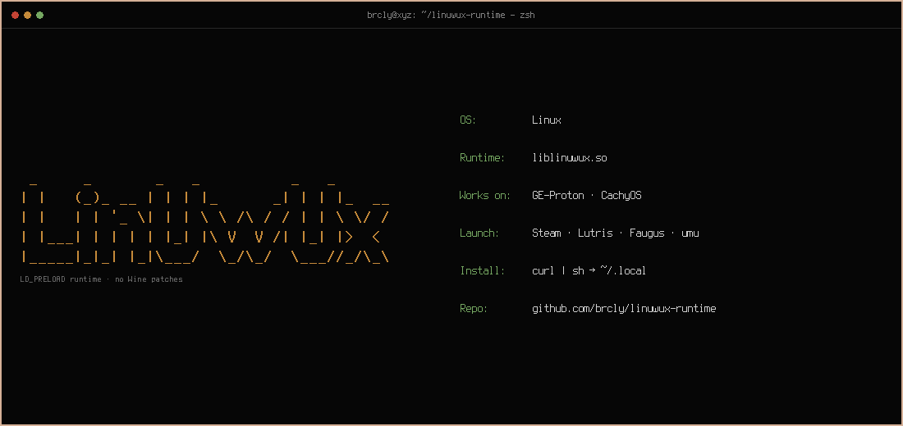

<p align="center">
  
</p>

## This is not the end, it's just a break. This project has become grotesquely mangled and needs a fresh start. So it will have one!

`liblinuwux.so` — an `LD_PRELOAD` library that supplies the Linux/Wine-side interpositions required by certain Windows software that expects a specific CPUID-faulting and signal protocol under **GE-Proton** or **CachyOS Proton**.

**No Proton/Wine source patches, no prefix registry imports, no launcher script rewrites.**

**Official Valve Proton is not supported.** Use GE-Proton or CachyOS Proton.

This project does **not** configure the host CPU or install any hypervisor. Those are separate system-level steps (UMIP, `cpuid_fault` support, etc.).

## What it covers

One library (`liblinuwux.so`) handles both the modern and legacy protocol layouts used by the software it supports. The protocol is detected at runtime — there is no second `.so` or legacy wrapper.

A process is treated as a target when the Windows executable sits next to a known marker file, for example:

- `reflex.dll` / `reflex64.dll`
- `winmm.dll`
- `version.dll`

### Older packages that ship `launcher.exe`

Some older packages include a Windows `launcher.exe`. **On Linux you do not need it.** Point Steam / Lutris / Heroic / umu at the actual game binary the same way you do for any other title, and put `linuwux` only on that game’s launch options.

## Install

**Prebuilt** (needs `curl`, `sha256sum`):

```bash
curl -fsSL https://raw.githubusercontent.com/brcly/linuwux-runtime/main/install.sh | sh
```

Installs `~/.local/lib/liblinuwux.so` and `~/.local/bin/linuwux`.

**From source** (needs `git`, `gcc`):

```bash
./build.sh --install
```

Same destinations; plain `./build.sh` afterward refreshes the installed `.so`.

## Launch (Steam example)

Per **game** launch options — not the whole Steam/Lutris UI (`~/.local/bin` on `PATH`):

```text
linuwux %command%
```

If a GUI app (e.g. Steam) was already running when you fixed `PATH`, restart it once — or use `~/.local/bin/linuwux %command%` until you do.

### Do not wrap the launcher

```bash
linuwux lutris     # wrong — preloads the UI, not the game
linuwux heroic     # wrong
```

Full setup for **Lutris, Heroic, Faugus, MangoHud order, gamescope limits, and common mistakes**:

- **[GitHub Wiki](https://github.com/brcly/linuwux-runtime/wiki)** (same pages when published)

## Requirements

| Path | Tools |
|------|--------|
| Prebuilt | `curl`, `sha256sum` |
| Source build | `git`, `gcc` |

## Reporting issues

Open an [issue](https://github.com/brcly/linuwux-runtime/issues/new/choose) with:

- `linuwux --version`
- A log from `LINUWUX_DEBUG=1 linuwux %command%` (or the equivalent on your launcher)
- GE-Proton/CachyOS version and game/DRM context

## License

[GNU Affero General Public License v3](LICENSE) (or later). Copyright (C) 2026 brcly.

Upstream Proton/Wine keep their own licenses. Preferred credit:

`LinUwUx by brcly (https://github.com/brcly/linuwux-runtime)`

## About the documentation

Parts of the docs and in-source comments were drafted with AI assistance, then reviewed and edited by hand. Library code, design decisions, and testing are human work — AI was not used to invent or implement bypass logic.

## Credits

- LinUwUx — original bypass creator  
- DenuvOwO — hypervisor bypass  
- [Kurt Himebauch](https://github.com/xXJSONDeruloXx) — legacy Reflex / multi-protocol compatibility
